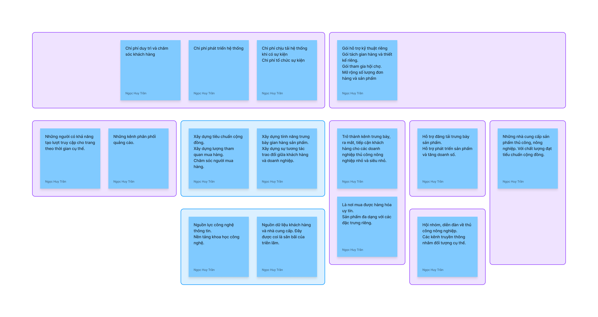
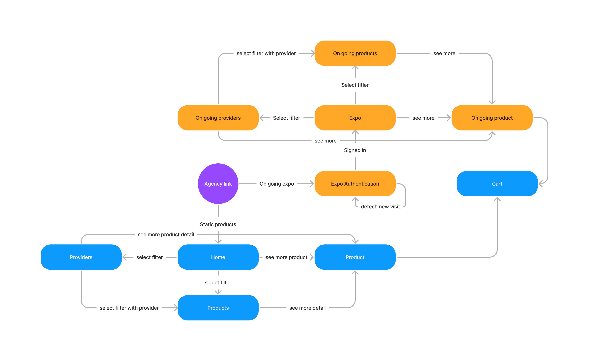
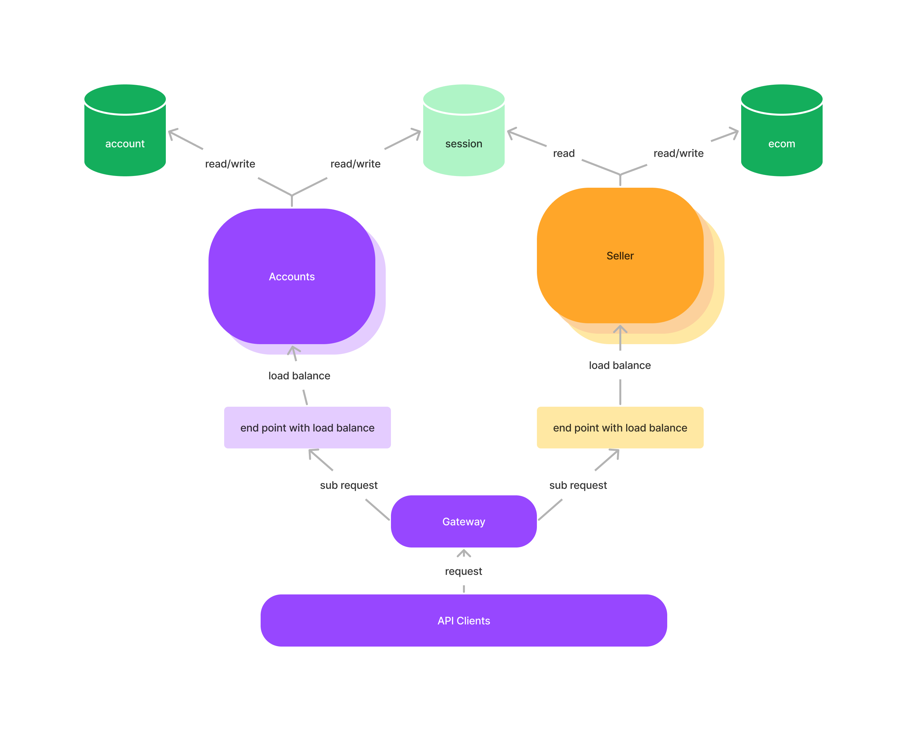

OCOPEE | Hệ Thống Hội Chợ Trực Tuyến

# Khái quát

## 1. Sứ mệnh

Việt Nam là một nước có truyền thống nông nghiệp. Với điều kiện tài nguyên thiên nhiên thuận lợi, nguồn nhân lực dồi
dào. Nông nghiệp đóng vai trò quan trọng trong sự phát triển kinh tế nước nhà.

Từ kỷ Hồng Bàng, trăm tộc Việt đã hợp sức tương trợ nhau. Nay, thời kì trăm hoa đua nở của nông nghiệp & công nghệ. OCOPEE muốn tham gia vào xây dựng nền nông nghiệp Việt Nam. Với vai trò như một bộ phận thúc đẩy giao thương mua bán.

## 2. Định hướng

Tìm kiếm đầu ra cho sản phẩm là vấn đề hết sức quan trọng đối với đơn vị sản xuất. Một trong những kênh bán hàng hiệu
quả có thể kể đến đó là chương trình hội chợ. Qua đợt dịch bệnh, chúng ta nhận thấy hội chợ vẫn có thể diễn ra với hình
thức trực tuyến. Hội chợ trực tuyến cần xây dựng nhằm tạo trải nghiệm giống với hội chợ truyền thống. Tuy khó khăn,
nhưng cũng là cơ hội giúp hình thức hội chợ truyền thống không còn giới hạn về mặt địa lý. Tạo ra một mạng mua sắm mới
cho người dùng cũng như kênh bán hàng mới cho các đơn vị sản xuất.

## 3. Mục Tiêu

Hội chợ trực tuyến xác định đối tượng trực tiếp phục vụ là khách mua hàng nông sản.

- Khách hàng là người ủng hộ sử dụng nông sản chất lượng.
- Khách mua hàng tin tưởng chất lượng sản phẩm đăng tải trên hội chợ trực tuyến.
- Khách hàng dành thời gian cho các sự kiện hội chợ.
- Khách hàng cảm thấy tiện lợi trong quy trình mua hàng.
- Khách hàng được tư vấn thông tin đầy đủ về giá trị sử dụng của sản phẩm.
- Khách hàng dễ dàng tìm kiếm sản phẩm phù hợp với nhu cầu.

Nhà bán hàng là người trả tiền cho hệ thống. Thông qua việc phục vụ người mua nông sản. Hệ thống gián tiếp đem lại giá
trị cho nhà bán hàng.

- Không gian mở rộng.
- Thời gian linh hoạt.
- Khách hàng tiềm năng.
- Phù hợp với quy mô.

## 4. Chiến lược

### 4.1 Bộ phận định hướng

Bộ phận định hướng bao gồm những cố vấn và đội ngũ chấp nhận kế hoạch.

Cố vấn là những người chuyên môn trong lĩnh vực được triển khai trong kế hoạch.

Đội ngũ chấp hành cần là người có kinh nghiệm trong việc vận hành tổ chức trước đó.

#### Phát triển con người

Ban cố vấn và đội ngũ chấp hành có nhiệm vụ thường xuyên tuyển chọn và đạo tạo. Để kế thừa, duy trì và phát huy năng lực
của đội ngũ sau này.

Việc phát triển con người nên thành lập thành câu lạc bộ, bộ phận cụ thể của tổ chức.

Đối chiếu với kế hoạch hiện tại, cần xây dựng và duy trì hai câu lạc bộ:

- Câu lạc bộ Software.
- Câu lạc bộ Marketing.

#### Đánh giá kết quả

Đánh giá kết quả được hiệu người có thể nhìn nhận tổng kết các số liệu trong thời gian hoạt động đã qua.

Các khía cạnh được tổng hợp đánh giá cần căn cứ theo mục tiêu hoạt động của tổ chức. Là tài liệu cơ sở để định hướng và
phát triển kế hoạch sau này.

### 4.2 Bộ phận kế hoạch

#### Xây dựng văn hóa

Xây dựng văn hóa hoạt động được xây dựng dựa trên các tinh thần sau:

##### Chủ động với tiến độ

“Báo cáo” là bước thông báo về tình trạng công việc được giao. Ví dụ, nếu bạn được cấp trên giao cho nhiệm vụ thì từ khi
bắt đầu thực hiện đến khi hoàn thành công việc, bạn phải luôn cập nhật tình hình, hiện trạng công việc cho cấp trên
biết. Điều này không chỉ giúp sếp của bạn và những đồng nghiệp xung quanh biết bạn đang làm gì và đánh giá đúng năng lực
của bạn, mà còn có thể hỗ trợ bạn ngay nếu có sự cố phát sinh.

- Báo cáo tiến độ công việc theo mẫu có sẵn.
- Báo cáo hằng ngày.

##### Trung thực với sự cố

Chính là việc thông báo cho những người liên quan khi có các vấn đề. Như thông báo cho cấp trên, thông báo cho những
người cùng nhóm, những người có liên quan.

Cùng chia sẻ thông tin. Không thêm thắt hoặc thay đổi thông tin

- Báo cáo sự cố khách quan, chi tiết.
- Không phạt cá nhân.

##### Tối ưu với phương pháp

Khi có một vấn đề xảy ra cần bàn bạc với người cấp trên hoặc là các trưởng nhóm để đưa ra giải pháp.

Nếu chưa hiểu rõ vấn đề nên bàn luận trao đổi, dù vấn đề đấy còn khá nhỏ. Sau khi thống nhất, kết quả cuối cùng phải
được truyền đạt đến những người liên quan.

Phương pháp cần đưa ra bàn bạc để hướng tới sự khách quan. Nhìn nhận vấn đề đa chiều hơn để đưa ra phương pháp phù hợp.
Tránh lãng phí thời gian, công sức.

- Cần trao đổi hướng giải quyết trước khi làm.
- Xây dựng kế hoạch cho tuần tiếp theo.

#### Xây dựng kế hoạch

Để đạt được mục tiêu đề ra. Chúng ta có thể nhận thấy cần truyền thông đến hai đối tượng: người mua hàng trên hệ thống
và người bán hàng trên hệ thống.

Cần truyền thông lợi thế cạnh tranh, điểm mạnh của cộng đồng người bán hàng đến với người mua hàng.

Và cũng truyền thông giá trị của hệ thống mang lại cho cộng đồng người bán.

Hệ thống cũng xác định cần xây dựng các tính năng đáp ứng cho mục đích sử dụng của người mua hàng, người bán hàng và mục
đích truyền thông.

Mỗi chiến lược như vậy sẽ được viết chi tiết trong tài liệu.

#### Xác định đối tượng

Chúng ta cần xác định rõ đối tượng cần phục vụ và đối tượng là khách hàng của hệ thống.

Thông qua đối tượng cần phục vụ là người mua hàng như đã nêu ở mục tiêu. Cần có kế hoạch mở rộng đối tượng và cải tiến
chất lượng hệ thống công nghệ. Dữ liệu người mua hàng, niềm tin của người mua hàng trên hệ thống được coi là nguồn lực
tài nguyên. Hệ thống công nghệ là công vụ chuyển hóa tài nguyên đó thành giá trị doanh nghiệp. Tức là khả năng tạo đầu
ra cho doanh nghiệp đối tác.

Các nhà sản xuất được coi là khách hàng của giá trị mà hệ thống công nghệ tạo ra. Họ không phải là khách mua hàng trên
hệ thống. Họ đang mua chỗ đứng trên hệ thống để bán hàng của chính họ. Như vậy, cần xác định kế hoạch chăm sóc và tiếp
cận các nhà sản xuất phù hợp.

# Phần 1

## 1. Phân tích

### 1.1 Phân tích trải nhiệm người dùng

Nhằm giữ được trải nghiệm của người mua sắm tại hội chợ truyền thống. Theo quan sát thì mình có nhận định sau:

- Là một chương trình có rất nhiều người tham gia.
- Có chương trình âm nhạc.
- Có khu vui chơi và ẩm thực.
- Sản phẩm phong phú và độc đáo.

Với vai trò là một người bán:

- Cơ hội tiếp cận được lượng khách lớn.
- Khách đến từ địa phương xung quanh khu vực tổ chức.
- Đi với gia đình hoặc đa số là người có gia đình.
- Khách có xu hướng tìm hiểu và mua sản phẩm hơn.

Đối với người tổ chức hội chợ:

- Có sân bãi, điều kiện để tổ chức sự kiện thu hút lượng người xung quanh đến hội chợ.
- Thu phí của các gian hàng để truy trì chương trình.

Như vậy, giống như hội chợ truyền thống. Hội chợ trực tuyến cần tổ chức ra các hoạt động vui chơi giải trí giúp thu hút
lượng lớn khách đến tham gia. Và liên hệ hội họp các nhà cung cấp tiềm năng. Để đáp ứng nhu cầu mua bán của mọi người.

### 2.2 Phân tích vai trò người dùng

#### 2.2.1 Người quản lí hệ thống

Nhóm quản lí có các nhiệm vụ sau:

- Tìm kiếm đối tác là người sở hữu nông trang, nhà xưởng. Giúp đối tác xây dựng gian hàng.
- Tìm kiếm nguồn lực là những người, đơn vị có khả năng thu hút khách hàng đến tham gia hội chợ.
- Cung cấp một số công cụ giúp người bán hàng và người thu hút khách hàng làm tốt nhiệm vụ của họ.

#### 2.2.2 Người bán hàng

Người bán hàng mang đến sản phẩm cho chương trình hội chợ. Đóng góp nguồn kinh phí để tổ chức.

#### 2.2.3 Người mua hàng

Đây là đối tượng phục vụ của hệ thống. Hệ thống cần tập trung, ưu tiên các tính năng mang đến trải nghiệm cho người
dùng.

Đồng thời dữ liệu khách hàng cũng là nguồn lực của hệ thống, cần có cơ chế thu nhập và phân tích thông tin người mua
hàng.

## 2. Giải pháp

#### 2.1 Dành cho người quản lí hệ thống

- Mời đối tác đóng góp sản phẩm.
- Hiển thị sản phẩm của mình và các đối tác trên trang của mình.
- Đếm được số khách hàng mỗi đối tác truyền thông thu hút được.

#### 2.2 Dành cho người bán hàng

- Quản lí sản phẩm.
- Quản lí thông tin nhà bán hàng.
- Quản lí thông tin đặt hàng.
- Quản lí khuyến mãi.
- Xem tương tác của người dùng tới gian hàng.

#### 2.3 Dành cho người mua hàng

- Xem gian hàng.
- Thủ tục vào sự kiện.
- Mua hàng.
- Tương tác với nhau.
- Tương tác nhanh với chủ cửa hàng.
- Nhận được thông báo hội chợ.

## 3. Đặc tả

Người dùng là nhà bán hàng có thể mở quản lí cửa hàng. Bao gồm việc đăng bán và quản lí chỉnh sửa các sản phẩm.

Người bán hàng có thể mời người khác cùng đăng sản phẩm trên trang của mình.

Đơn hàng được tạo trên trang sẽ thuộc quyền sở hữu và quyền xem của người sở hữu trang đó.

Khách hàng có thể xem gian hàng và đặt hàng trên trang mua sắm.

Khách hàng có thể nhìn thấy lịch sử đặt hàng của mình.

Nhà bán hàng cũng có thể nhìn thấy đơn hàng được đặt trên trang mua sắm của họ.

Nhà bán hàng có thể cập nhật trang thái đơn hàng.

## 4. Phân tích hệ thống

### 4.1 Usecase diagram

### 4.2 Class diagram

### 4.3 State diagram

## 5. Cơ sở lí thuyết

## 6. Thiết kế hệ thống

### 6.1 Triến trúc hệ thống

### 6.2 Triến trúc giao diện
